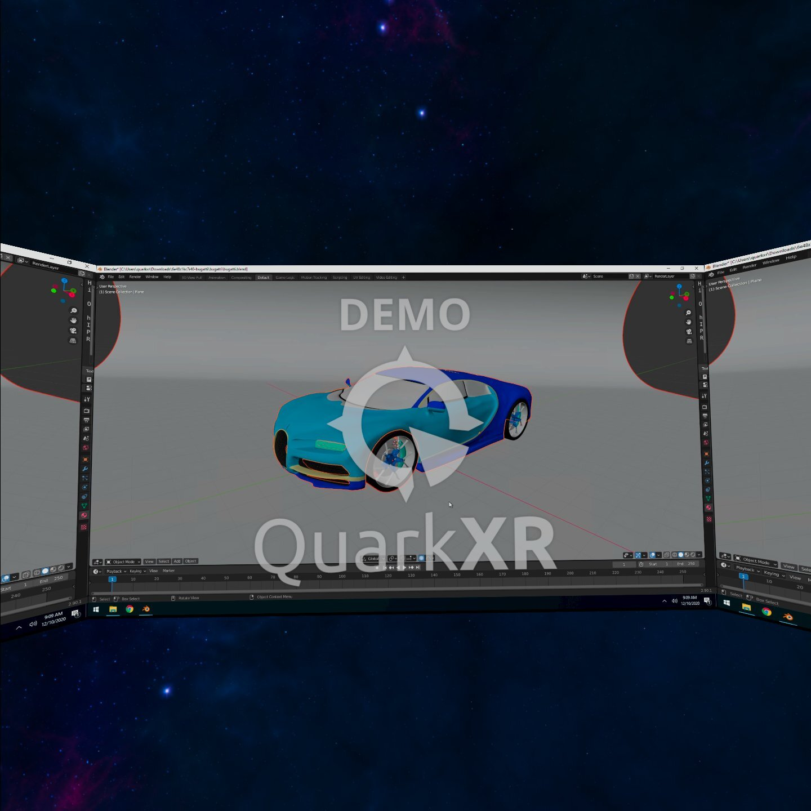

# Welcome to the QuarkXR Unity SDK

The QuarkXR Unity SDK gives you the ability to integrate desktop streaming into any Unity android project. It can be used to stream your local Windows 10 desktop and also any remote desktop (any Cloud VM running Windows 10 or Windows Server 2016+). A later release will enable developers to also stream XR content rendered remotely. Support for streaming additional monitors is coming soon! Support for additional client platforms is coming soon!

This repository contains the SDK via a Unity Package, a QuarkXR Server installer, and sample projects. Detailed instructions for implementing the SDK are available on the GitHub Wiki. Check the FAQ section for troubleshooting issues.

If you run into any issues, don't hesitate to contact us at https://www.quarkxr.com/contact-us.

